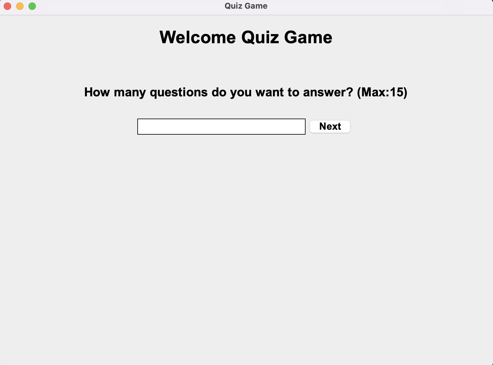
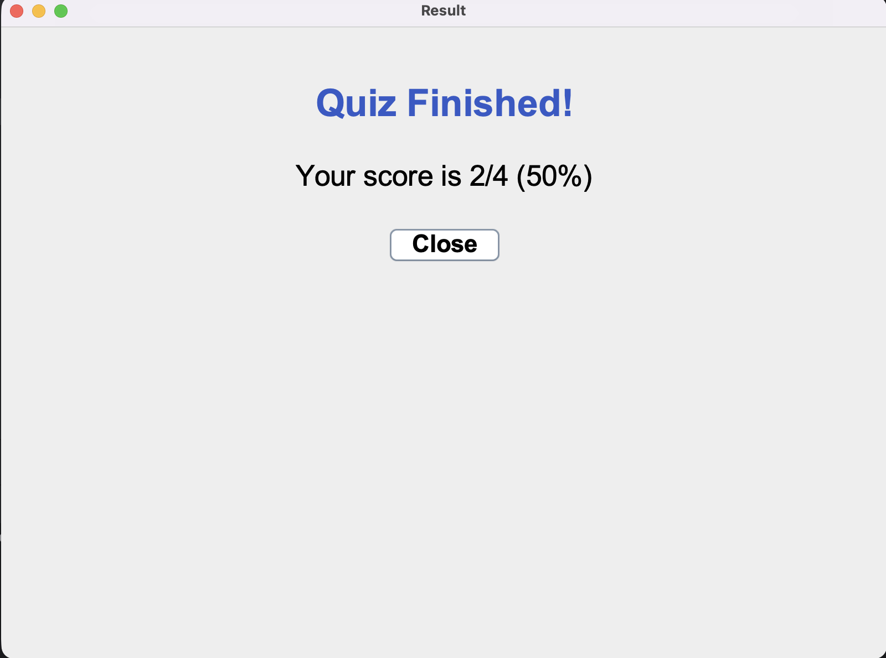

# Quizz App — React

A lightweight quiz application built with **React**.  
The app loads all quiz questions from an external `.txt` file, displays them to the user, and calculates the final score.

---

## 🚀 Features

### ✅ Frontend (React)
- Clean and responsive UI  
- Renders questions loaded from a text file  
- Multiple-choice answer selection  
- Real-time score tracking  
- "Next Question" flow  
- Final results screen  
- Ability to restart the quiz  

### 📄 Question Loading (TXT File)
- Questions are stored externally in a `.txt` file  
- App reads and parses the file at runtime  
- Easy to add, update, or remove questions without touching the code  
- Simple format for questions & answers  

---

## 🛠️ Tech Stack

**Frontend:**  
- React  
- Vite  
- JavaScript  
- CSS  

---

## 📁 Project Files

- `questions.txt` — contains all quiz questions and possible answers  
- `src/` — React components and logic  
- `public/` — static assets  

---

## 📸 Screenshots

### Main Quiz UI  

### Question View  

### Quiz Result Screen  

---

